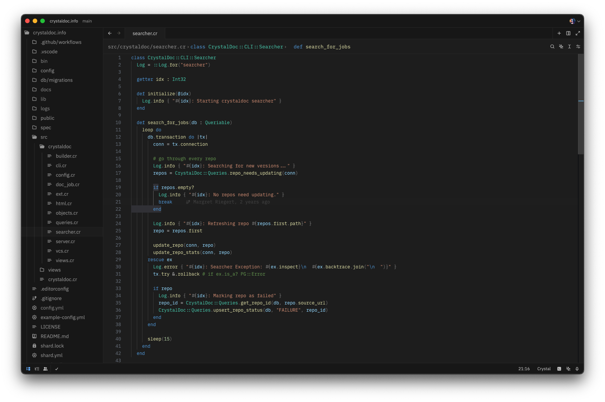

# Crystal Lang Support for Zed

Uses the Crystal lang tree-sitter found at [crystal-lang-tools/tree-sitter-crystal](https://github.com/crystal-lang-tools/tree-sitter-crystal),
which is mostly complete, and can parse the majority of Crystal's own source code without errors.

Also uses [Crystalline](https://github.com/elbywan/crystalline) for LSP functionality, if it is available in `$PATH`.



## Using Crystal's Formatter
Copy the following into Zed's settings file:
```json
"languages": {
  "Crystal": {
    "tab_size": 2,
    "formatter": {
      "external": {
        "command": "crystal",
        "arguments": [
          "tool",
          "format",
          "-"
        ]
      }
    }
  }
}
```
